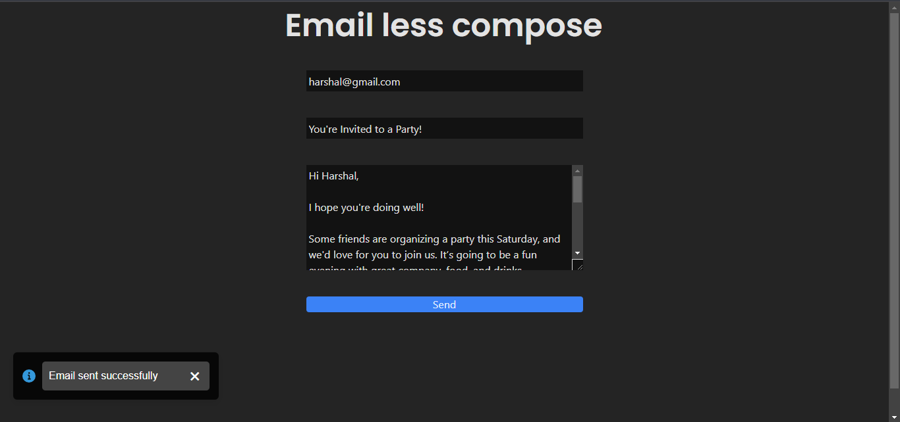

# Email Compose Application

This application allows you to send emails without opening an email client. It is built using React, Tailwind CSS, and Node.js. The app is fully responsive and uses various libraries and modules including `react-toastify`, `nodemailer`, `express`, and `body-parser` to provide a seamless experience for sending emails and receiving notifications.

 
 

 
## Features

- Compose and send emails directly from the web application.
- Notifications based on whether the email is sent successfully or if there's an error.
- Responsive design with Tailwind CSS.
- Separate front-end and back-end implementations.
- Requires an app password for email authentication.

## Front-End

The front-end is built with React and styled using Tailwind CSS. It utilizes `react-toastify` to display notifications about the email sending status.

## Back-End

The back-end is built using `express`, `cors` and `body-parser` for ensuring communication. Is utilizes `nodemailer` to send emails without opening client gmail.

### Key Files

- `src/App.jsx`: Main application component.
- `src/main.jsx`: Entry point of the React application.
- `index.html`: HTML template for the React app.
- `server.js`: HTML template for the React app.

### Clone this 
''' ssh
https://github.com/YashodharChavan/email-less-compose.git

